<div align="center">
	
    <h1>
        模型API网关
    </h1>
    <p align="center">
    
    
    
    
	</p>
	<p>&nbsp;</p>
</div>


多平台大模型统一网关，完全兼容 OpenAI v1 接口，支持 DeepSeek、MiniMax、GLM、小米、SiliconFlow、ModelScope、Coze、Dify 等 8 家平台，附带限流、计费、时段控制和完整的请求追踪。


## 特性

| 功能 | 说明 |
|------|------|
| **OpenAI 兼容** | `/v1/chat/completions` / `/v1/models`，任何 OpenAI 客户端直连 |
| **多平台统一接入** | DeepSeek / MiniMax / GLM / 小米 / SiliconFlow / ModelScope / Coze / Dify |
| **智能体支持** | `agent:xxx` 模型别名，每个智能体独立 API Key、Bot ID |
| **三级限流** | 全局 / 按 Key / 按厂商，互不影响 |
| **计费系统** | 按 token 计费，支持输入/输出单价分离 |
| **时段控制** | 按 API Key 配置可用时段（工作日/非工作日/精确时段） |
| **请求追踪** | 完整生命周期日志（pending → running → success/error），含 TTFT |
| **加密存储** | API Key 加密落库，数据库泄露不泄露密钥 |
| **管理后台** | Vue 前端，可视化管理供应商/模型/Key/智能体/日志/监控 |
| **双数据库** | SQLite（开发） / MySQL（生产），无缝切换 |


## 快速开始

### 环境

- Python 3.9+
- MySQL 8.0+（生产）或 SQLite（开发）
- uv（推荐）或 pip

### 1. 克隆与安装

```bash
git clone https://github.com/your-org/model-gateway.git
cd model-gateway

# 安装依赖（推荐 uv）
uv sync

# 或 pip
pip install -r requirements.txt
```

### 2. 配置环境变量

```bash
cp .env.example .env
```

关键配置项：

```env
# 数据库（MySQL）
DB_HOST=127.0.0.1
DB_PORT=3306
DB_USER=root
DB_PASSWORD=your_password
DB_NAME=model_gateway

# 密钥（生产必须修改，用于加密 API Key）
ENCRYPT_SECRET_KEY=your-32-char-secret-key-here

# 管理后台 Token
ADMIN_TOKEN=change_me_to_a_strong_token

# 并发控制（可选）
GLOBAL_MAX_CONCURRENCY=200
KEY_MAX_CONCURRENCY=20
```

> **SQLite 开发模式**：只保留 `DB_NAME=model_gateway`，其余数据库配置留空即可自动切换到 SQLite。

### 3. 初始化数据库

```bash
uv run python -m db.init
# 或
python -m db.init
```

### 4. 启动服务

```bash
uv run python main.py
# 默认 http://localhost:8086
```

服务就绪后：
- 管理后台：`http://localhost:8086/ui/`
- API 文档：`http://localhost:8086/docs`
- 健康检查：`http://localhost:8086/health`

### 5. 编译

**windows环境**

```bash
# 默认独立目录模式
build_windows.bat

# 单文件 exe
build_windows.bat onefile

# 清理后重新编译
build_windows.bat clean

# 清理 + 单文件
build_windows.bat onefile clean
```

**linux环境**

```bash
# 默认独立目录模式
bash build_linux.sh

# 单文件二进制
bash build_linux.sh --onefile

# 先清理再编译
bash build_linux.sh --clean --onefile
```


## API 调用

### 基础调用

```bash
curl http://localhost:8086/v1/chat/completions \
  -H "Content-Type: application/json" \
  -H "Authorization: Bearer sk-gw-xxxxx" \
  -d '{
    "model": "deepseek-chat",
    "messages": [{"role": "user", "content": "Hello"}],
    "stream": false
  }'
```

### 流式调用

```bash
curl http://localhost:8086/v1/chat/completions \
  -H "Content-Type: application/json" \
  -H "Authorization: Bearer sk-gw-xxxxx" \
  -d '{
    "model": "deepseek-chat",
    "messages": [{"role": "user", "content": "Write a story"}],
    "stream": true
  }'
```

### 调用智能体

```bash
curl http://localhost:8086/v1/chat/completions \
  -H "Content-Type: application/json" \
  -H "Authorization: Bearer sk-gw-xxxxx" \
  -d '{
    "model": "agent:my-coze-bot",
    "messages": [{"role": "user", "content": "Hello"}]
  }'
```

> 模型别名 `agent:xxx` 触发智能体路由，从 `agent_configs` 表取该智能体专属的 API Key 和 Bot ID。


## 支持的平台

| 平台 | Provider Key | 备注 |
|------|-------------|------|
| DeepSeek | `deepseek` | 标准 OpenAI 兼容 |
| MiniMax | `minimax` | 标准 OpenAI 兼容 |
| 智谱 GLM | `glm` | 标准 OpenAI 兼容 |
| 小米 | `xiaomi` | 标准 OpenAI 兼容 |
| SiliconFlow | `siliconflow` | 标准 OpenAI 兼容 |
| ModelScope | `modelscope` | 标准 OpenAI 兼容 |
| Coze | `coze` | 需要 Bot ID（数字 ID，非应用名）|
| Dify | `dify` | 流式 / 非流式均支持 |

### Coze 特殊配置

Coze 请求体中 `bot_id` 为必选字段，值为 Coze 平台上的**数字 Bot ID**（不是 Bot 名称）。

在"模型管理"页面，为 Coze 模型填写**额外配置**：

```json
{"bot_id": "73928472938240xxxx"}
```

### Dify 特殊配置

Dify 通过 `response_mode` 控制返回方式：
- `streaming`：SSE 流式返回
- `blocking`：同步等待完整结果后返回


## 管理后台

访问 `http://localhost:8086/ui/`，使用 `ADMIN_TOKEN` 登录。

| 模块 | 功能 |
|------|------|
| **供应商管理** | 添加/编辑/禁用各平台配置（base_url / api_key / 超时 / 并发上限）|
| **模型管理** | 配置模型别名 ↔ 上游模型映射、输入/输出单价、额外请求头 |
| **API Key 管理** | 签发、吊销、设置模型白名单、并发上限、可用时段 |
| **智能体管理** | 配置智能体专属 API Key、Bot ID、基础 URL |
| **请求日志** | 查看所有请求记录，含状态、耗时、Token 消耗、TTFT |
| **监控面板** | QPS / 错误率 / Token 消耗趋势图 |
| **计费记录** | 按 Key / 模型 / 时间段查询费用明细 |

<table>
    <tr>
        <td>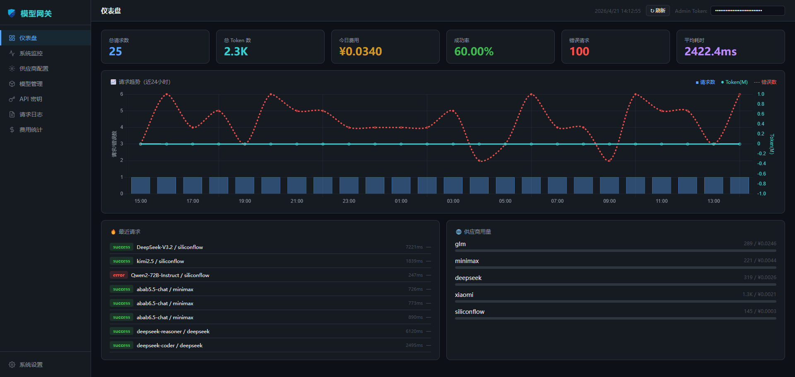</td>
        <td>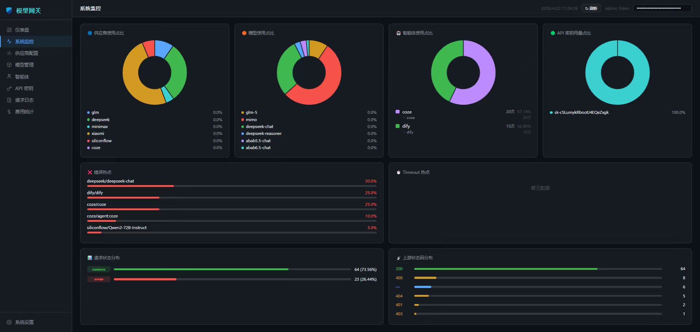</td>
    </tr>
    <tr>
        <td>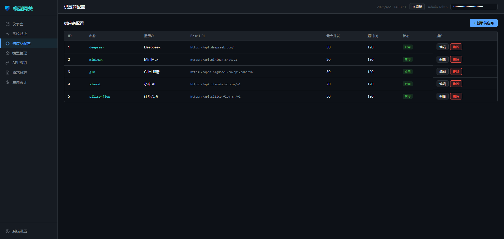</td>
        <td>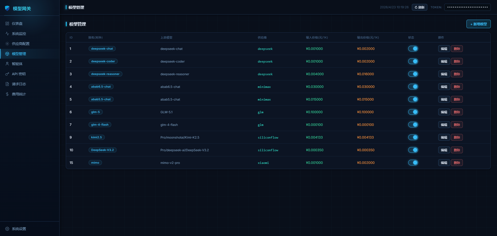</td>
    </tr>
    <tr>
        <td>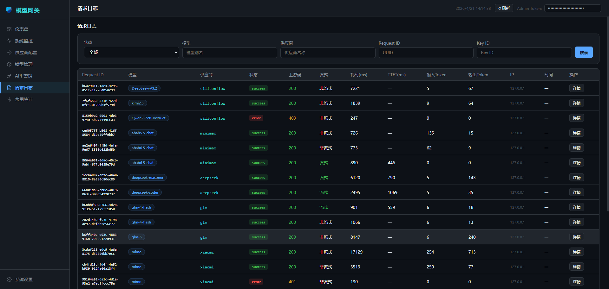</td>
        <td>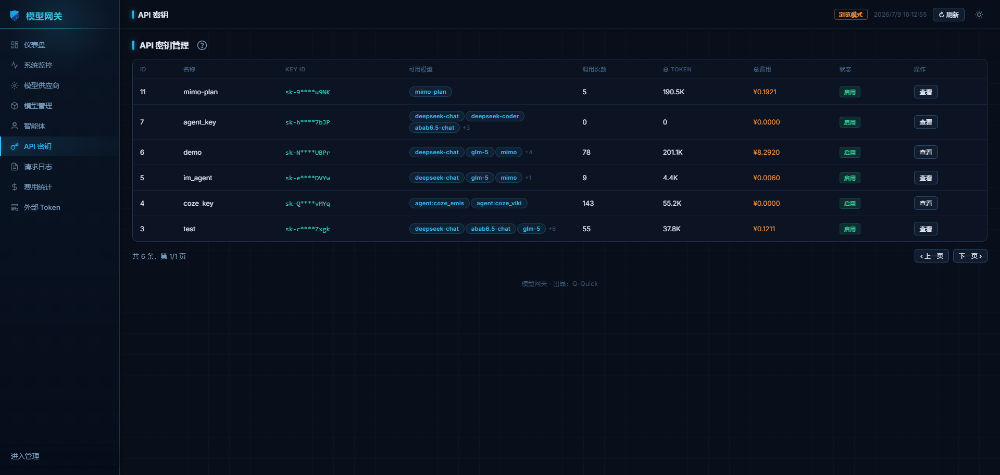</td>
    </tr>
    <tr>
        <td>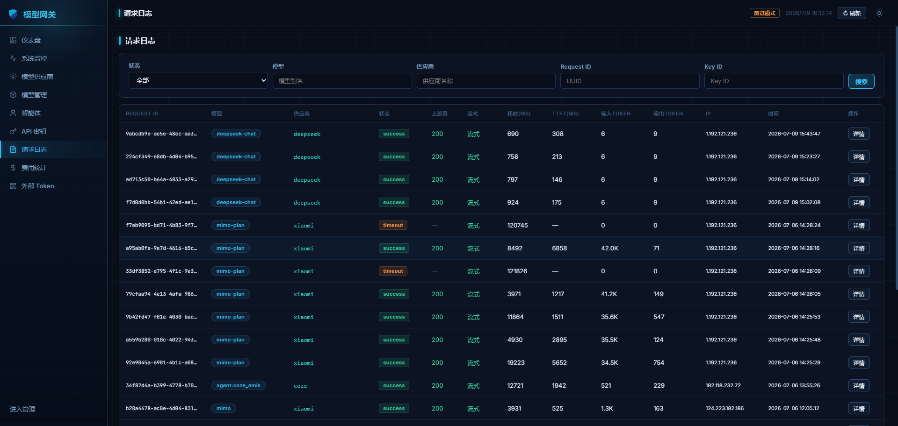</td>
        <td>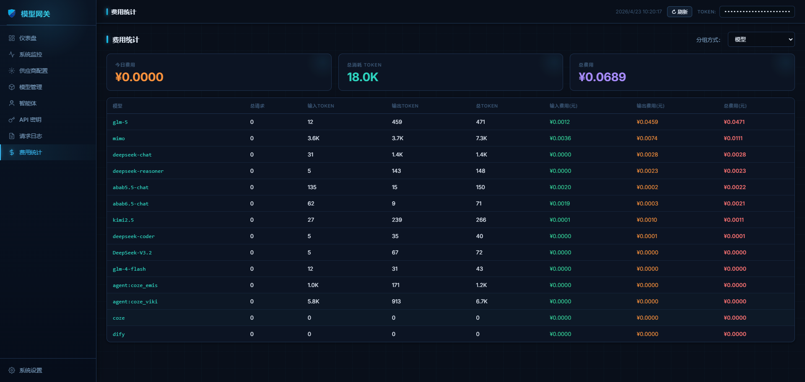</td>
    </tr>
    <tr>
        <td>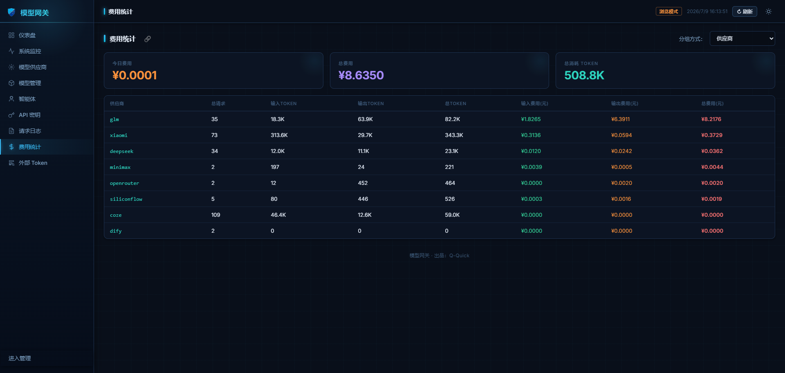</td>
        <td>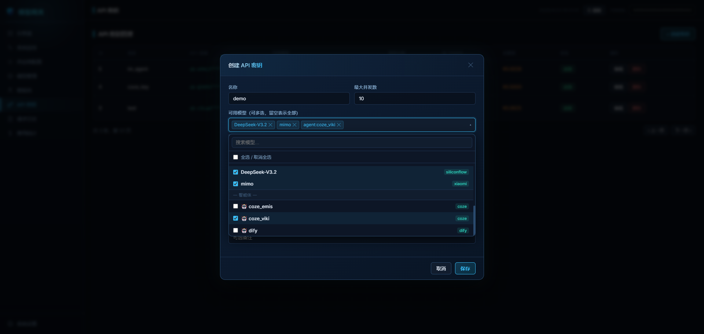</td>
    </tr>
</table>

## 限流机制

三级并发控制，互不干扰：

```
请求到达
  │
  ▼
1. 检查 Key 并发上限（每个 API Key 独立计数）
  │
  ├── 未超 → 继续
  └── 超限 → HTTP 429
  │
  ▼
2. 检查 Provider 并发上限（每个厂商独立计数）
  │
  ├── 未超 → 继续
  └── 超限 → HTTP 429（该 Key 其他模型不受影响）
  │
  ▼
3. 检查全局并发上限
  │
  ├── 未超 → 继续
  └── 超限 → HTTP 429
```


## 安全

- **API Key 加密**：使用 Fernet 对称加密存储，数据库泄露不泄露密钥
- **时段控制**：支持按工作日/非工作日/精确时段配置 Key 可用时间
- **模型白名单**：每个 API Key 只能访问授权的模型，防止滥用
- **管理 Token**：管理后台与普通 API Key 完全隔离


## 部署

### Docker（推荐）

```dockerfile
FROM python:3.11-slim
WORKDIR /app
COPY . .
RUN pip install -r requirements.txt
EXPOSE 8086
CMD ["python", "main.py"]
```

### Docker Compose（MySQL + Gateway）

```yaml
version: '3.8'
services:
  mysql:
    image: mysql:8.0
    environment:
      MYSQL_ROOT_PASSWORD: password
      MYSQL_DATABASE: model_gateway
    ports:
      - "3306:3306"

  gateway:
    build: .
    ports:
      - "8086:8086"
    environment:
      DB_HOST: mysql
      DB_PORT: 3306
      DB_USER: root
      DB_PASSWORD: password
      DB_NAME: model_gateway
      ENCRYPT_SECRET_KEY: change_me_32_chars_secret_key
      ADMIN_TOKEN: change_me
    depends_on:
      - mysql
```

### Nginx 反向代理

```nginx
server {
    listen 80;
    server_name gateway.example.com;

    location / {
        proxy_pass http://127.0.0.1:8086;
        proxy_set_header Host $host;
        proxy_set_header X-Real-IP $remote_addr;
        # SSE 流式响应需要
        proxy_buffering off;
        proxy_cache off;
        proxy_read_timeout 300s;
    }
}
```

### Cherry Studio 中调用

<table>
    <tr>
        <td>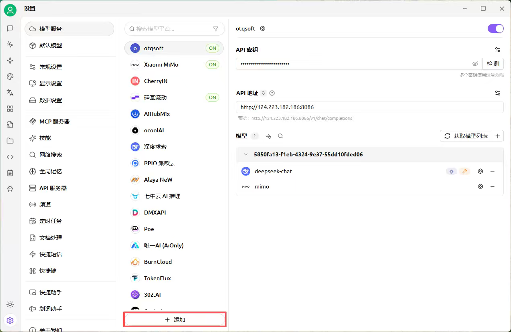</td>
        <td>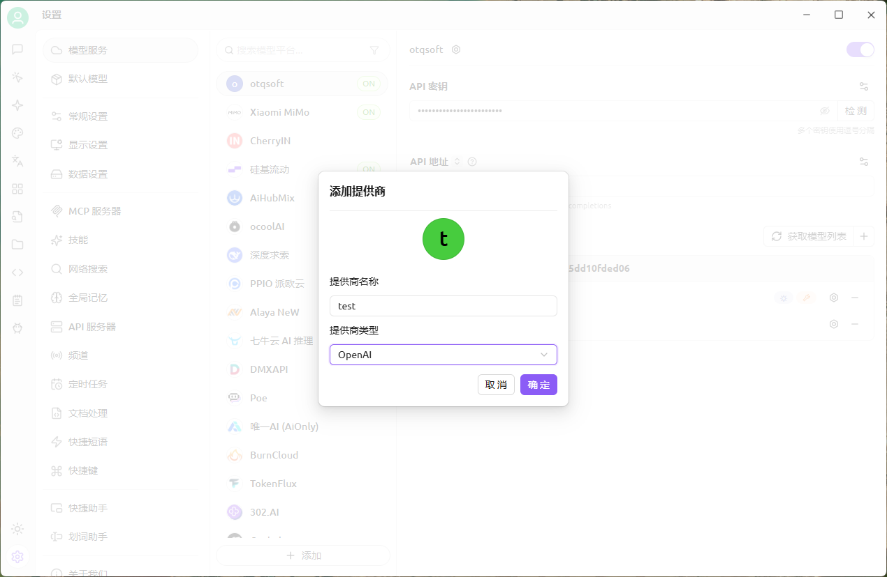</td>
    </tr>
    <tr>
        <td>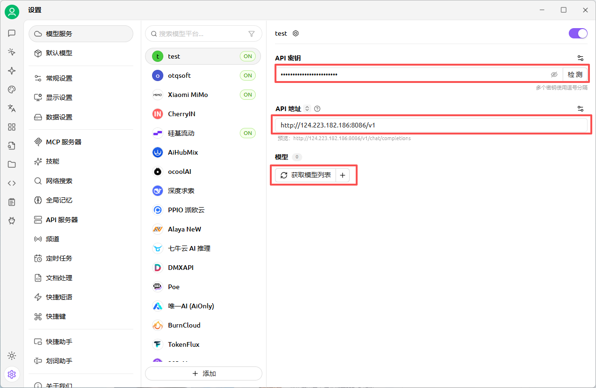</td>
        <td>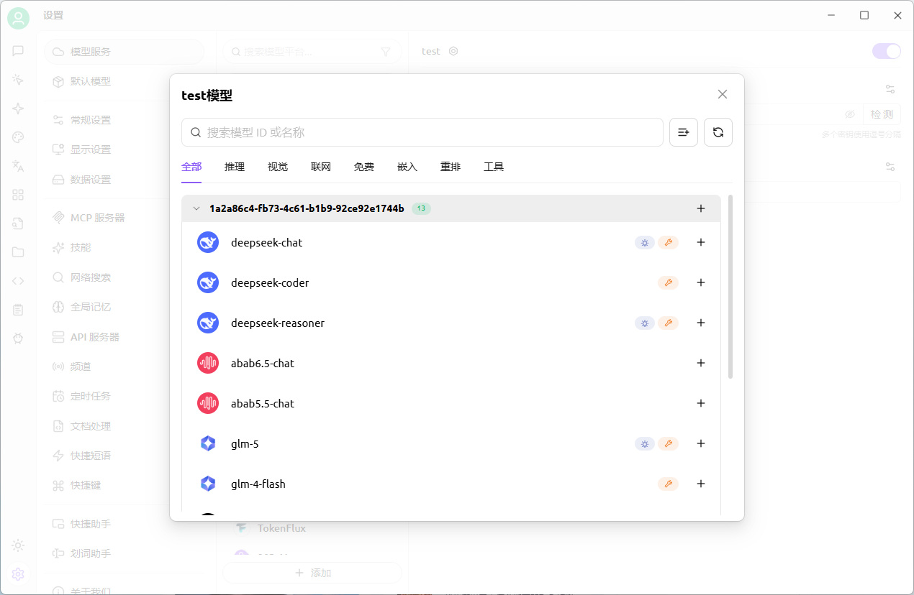</td>
    </tr>
    <tr>
        <td>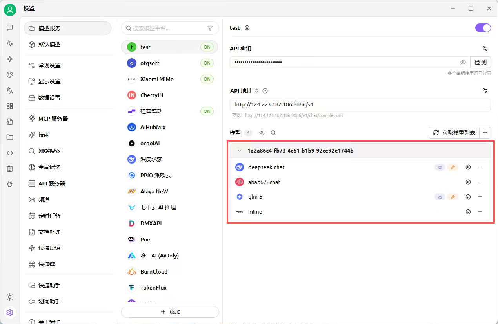</td>
        <td>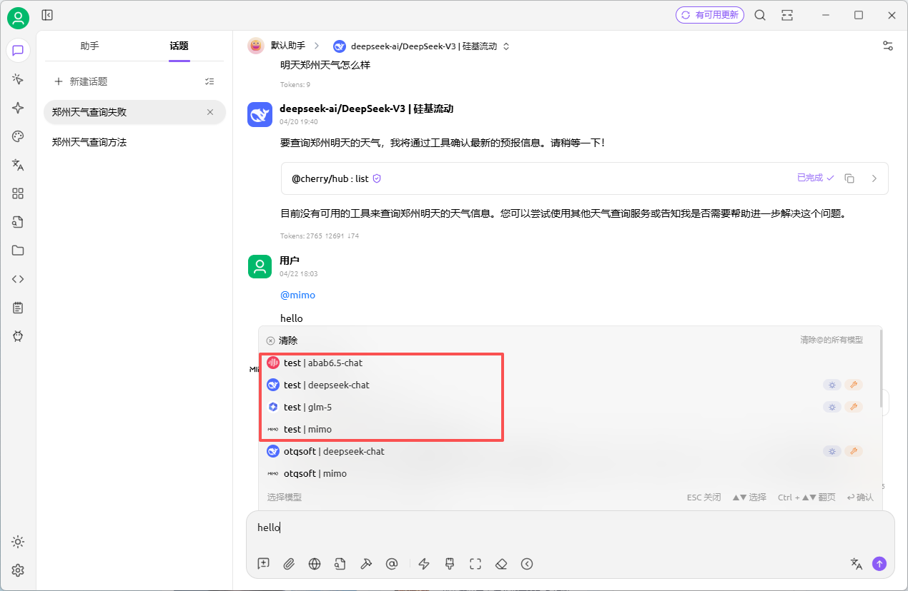</td>
    </tr>
</table>


## 配置参考

### .env 完整配置

```env
# 数据库
DB_HOST=127.0.0.1
DB_PORT=3306
DB_USER=root
DB_PASSWORD=your_password
DB_NAME=model_gateway
DB_POOL_MIN=5
DB_POOL_MAX=20

# 加密（生产必须设置，32位随机字符串）
ENCRYPT_SECRET_KEY=your-32-char-secret-key-here

# 并发控制
GLOBAL_MAX_CONCURRENCY=200
KEY_MAX_CONCURRENCY=20

# 管理后台
ADMIN_TOKEN=change_me_to_a_strong_token

# 服务
APP_ENV=development   # development / production
LOG_LEVEL=INFO       # DEBUG / INFO / WARNING
```


## 开发

### 添加新平台适配器

1. 在 `providers/` 创建 `xxx.py`，继承 `BaseProvider`：

```python
from providers.base import BaseProvider

class XxxProvider(BaseProvider):
    """Xxx 平台适配器"""

    def __init__(
        self,
        base_url: str,
        api_key: str,
        timeout_seconds: int = 120,
        extra_headers: dict | None = None,
    ):
        super().__init__(base_url, api_key, timeout_seconds, extra_headers)

    async def chat_completion(self, request, upstream_model: str):
        # 实现 chat_completion 方法
        ...
```

2. 在 `providers/registry.py` 注册：

```python
from providers.xxx import XxxProvider

_PROVIDER_CLASS_MAP = {
    # ...existing
    "xxx": XxxProvider,
}
```

3. 在数据库 `model_providers` 表插入记录，`provider_name = "xxx"`

### 运行测试

```bash
uv run pytest
# 或只运行特定模块
uv run pytest tests/test_providers.py -v
```


## 许可证

本项目基于 MIT 许可证开源。
